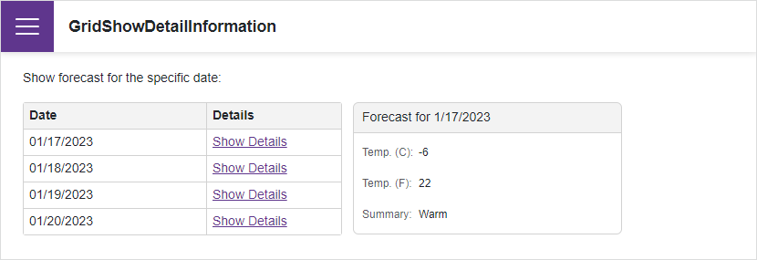

<!-- default badges list -->

<!-- default badges end -->

# Blazor Grid - How to display detail information using DxFormLayout

This example uses a DevExpress [Blazor Grid](https://docs.devexpress.com/Blazor/403143/grid) and a template grid column. The template grid column includes a **Show Details** link. Once clicked, detailed information about the current grid record is displayed on-screen (we use the DevExpress [Blazor Form Layout](https://docs.devexpress.com/Blazor/DevExpress.Blazor.DxFormLayout) to render detail info).

## Files to Review

* [Index.razor](./CS/GridShowDetailInformation/Pages/Index.razor)

## Documentation

* [CellDisplayTemplate](https://docs.devexpress.com/Blazor/DevExpress.Blazor.DxGridDataColumn.CellDisplayTemplate)
<!-- feedback -->
## Does this example address your development requirements/objectives?

 

(you will be redirected to DevExpress.com to submit your response)
<!-- feedback end -->
